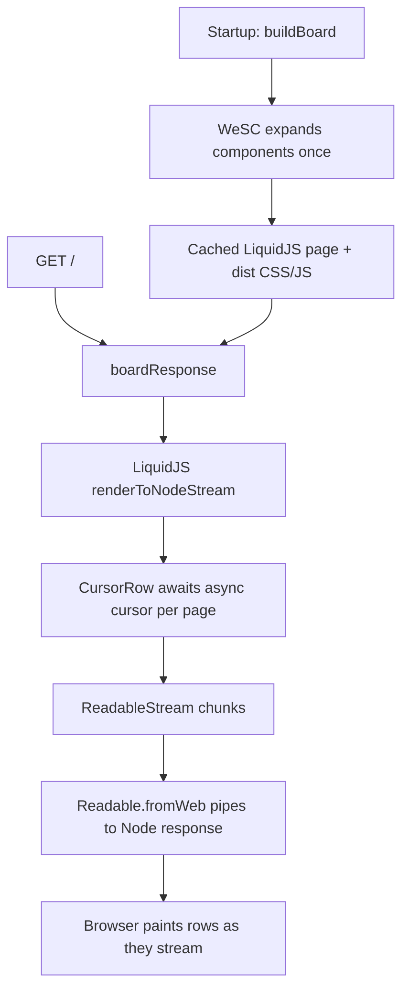

# Departures Board — streaming SSR example

A live airport departures board that server-renders **~10,000 WeSC
components per request** and streams them to the browser as a single
HTML document. It shows how to combine three things:

- **WeSC** — single-file components compiled once into a reusable HTML
  template plus bundled CSS/JS.
- **LiquidJS** — the template/data layer that loops over the rows and
  stamps each one.
- **An async cursor** — a paginated, backpressure-friendly data source
  so the first rows flush to the browser while later pages are still
  being generated.

The public surface is a standard web `Response` / `ReadableStream`, so
the same rendering code runs on Node, a Cloudflare Worker, Deno, Bun, or
a Next.js handler.

## Running it

From the repository root:

```sh
npm run build:native                          # build the native WeSC binding
npm install --prefix examples/departures-board # install liquidjs
npm start --prefix examples/departures-board   # node app/server.mjs
```

Then open <http://localhost:3000>.

Configuration is read from environment variables:

| Variable         | Default     | Description                          |
| ---------------- | ----------- | ------------------------------------ |
| `HOST`           | `127.0.0.1` | Interface to bind                    |
| `PORT`           | `3000`      | Port to listen on                    |
| `ROWS`           | `10000`     | Number of flight rows to stream      |
| `ROW_BATCH_SIZE` | `64`        | Cursor page size (rows per `await`)  |

```sh
ROWS=50000 npm start --prefix examples/departures-board
```

## Project layout

```
app/
  server.mjs              Node http server; adapts the web stream to a Node response
  board.mjs               Rendering core: builds components, drives LiquidJS, returns a Response
  flight-data.mjs         Fake paginated async data source (a DB/HTTP cursor stand-in)
  templates/
    index.liquid          Page template + WeSC component definitions (the build entry point)
  components/
    shell.liquid          Page chrome + global styles
    flight-row.liquid     A row: template, scoped CSS, upgrade script (expand/collapse)
    status-badge.liquid   Status pill component
dist/                     Generated CSS/JS bundles (gitignored)
```

## How it works

### 1. WeSC expands the components once at startup

`app/templates/index.liquid` declares the components it uses and then
uses them like ordinary custom elements:

```html
<link rel="definition" name="flight-row" href="../components/flight-row.liquid">
<link rel="definition" name="status-badge" href="../components/status-badge.liquid">
...
<flight-row data-eta="{{ flight.eta }}">
  <span slot="flight">{{ flight.flight }}</span>
  <status-badge slot="status" status="{{ flight.statusKey }}">{{ flight.statusLabel }}</status-badge>
  ...
</flight-row>
```

`buildBoard()` in `app/board.mjs` runs the WeSC bundler a single time:

```js
const page = build({
  entryPoints: ['app/templates/index.liquid'],
  outjs: 'dist/scripts.js',
  outcss: 'dist/styles.css',
}).toString('utf8').trim();
```

WeSC stamps every `<flight-row>` / `<status-badge>` into
Declarative-Shadow-DOM-ready HTML, hoists each component's scoped CSS
into `dist/styles.css`, and bundles the upgrade scripts into
`dist/scripts.js`. The Liquid `` loop and `{{ ... }}` tags are
left untouched — WeSC owns components, LiquidJS owns the data.

The result is one cached LiquidJS page template plus two static asset
bundles. None of this work happens per request.

### 2. LiquidJS streams the rows per request

`boardResponse()` parses the cached page once and renders it to a Node
stream, which is wrapped into a standard web `ReadableStream`:

```js
const engine = new Liquid();
const page = engine.parse(assets.page);
const nodeStream = engine.renderToNodeStream(page, { rowCount, flights });
```

Because rendering is streamed, the document shell and the earliest rows
are flushed to the browser before the last rows even exist.

### 3. The async cursor provides backpressure

Each of the `flights` passed to LiquidJS is a `CursorRow`, a LiquidJS
`Drop` whose **first property access awaits the cursor**:

```js
class CursorRow extends Drop {
  liquidMethodMissing(key) {
    if (this.row) return this.row[key];
    return this.cursor.next().then((row) => {
      this.row = row;
      return row[key];
    });
  }
}
```

The cursor (`createDepartureCursor` in `app/flight-data.mjs`) hands out
one row at a time and transparently `await`s a "page fetch" whenever the
current page is exhausted:

```js
async function fetchPage() {
  // A real cursor awaits I/O here (DB round-trip, HTTP page, ...).
  await new Promise((resolve) => setImmediate(resolve));
  ...
}
```

That `await` is what hands the event loop back, letting the HTTP socket
flush already-rendered rows before the next page is ready — which keeps
time-to-first-byte low and memory bounded, even for tens of thousands of
rows. Swap `fetchPage` for a real database or HTTP call and nothing else
changes.

### 4. The server adapts the web stream to Node

`app/board.mjs` returns a web `Response`. `app/server.mjs` serves it on
Node's `http` server by turning the web stream back into a Node stream:

```js
Readable.fromWeb(response.body).pipe(res);
```

It also serves the cached bundles at `/styles.css` and `/scripts.js`.
On a Worker / Deno / Bun runtime you would return the `Response`
directly:

```js
export default { fetch: () => boardResponse({ rowCount: 10_000 }) };
```

## Request flow



## Progressive enhancement

The streamed HTML is fully rendered without JavaScript — the board is
readable immediately. `dist/scripts.js` then upgrades each
`<flight-row>` so rows become keyboard-focusable and expand to show
details on click/Enter. Open a row to see the per-component upgrade
script (`app/components/flight-row.liquid`) in action.
