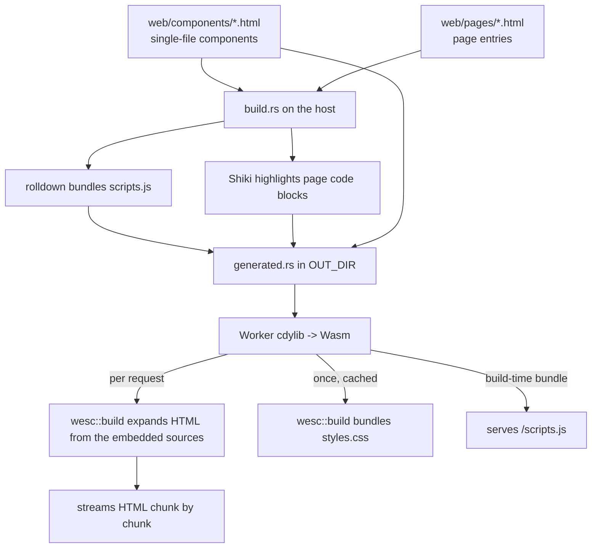

# WeSC site

The WeSC marketing/docs site, written in Rust and deployed as a
[Cloudflare Worker](https://developers.cloudflare.com/workers/languages/rust/).

It **dogfoods wesc at runtime**: the pages are authored as single-file `.html`
components and the Worker runs wesc **inside the request handler** to expand
them into HTML on the fly. wesc targets `wasm32-unknown-unknown`, so the same
bundler that powers the CLI runs in the Worker. One deployment serves the
landing page, the documentation page, and a request-specific 404 — each
rendered per request, not pre-built.

## How the dogfooding works

wesc runs on wasm for **HTML expansion** and **CSS bundling**. The only piece it
can't do on wasm is **JS bundling**, which depends on
[rolldown](https://rolldown.rs) (native-only). So almost everything happens at
request time in the Worker; the build step only prepares the two artifacts that
can't be produced on wasm — the `scripts.js` bundle and Shiki-highlighted code
blocks — and embeds the component sources into the binary.



- `web/assets.html` is an asset-only manifest containing only
  `rel="definition"` links. At build time wesc resolves those definitions and
  bundles `scripts.js` with rolldown (each component's top-level `<script>` is
  stripped from the markup and bundled here). At runtime the Worker resolves the
  same manifest to bundle `styles.css` (CSS bundling needs no rolldown, so it
  runs on wasm) — built once and cached, since it's identical for every request.
- Each page's code blocks are syntax-highlighted by Shiki at build time, over
  the page **source** (the blocks are static markup). The highlighted sources
  and the component sources are embedded into the Wasm binary.
- For every page request the Worker calls `wesc::build` with those sources as an
  in-memory `source` map, so the build never touches a filesystem, and streams
  the expanded HTML in bounded chunks.

## Layout

| Path                  | What                                                          |
| --------------------- | ------------------------------------------------------------- |
| `web/components/layout.html` | Shared `w-layout` component; pages use it with `w-trim` and fill `title`, `description`, and default content slots. |
| `web/components/*.html` | Single-file wesc components (header, footer, feature card, copy button). |
| `web/pages/*.html`    | Page entries that wrap their content in `<w-layout w-trim>`.  |
| `web/assets.html`     | Link-only asset manifest that pulls in every component to build the CSS/JS bundles. |
| `build.rs`            | Host build dep: bundles `scripts.js` (rolldown), runs Shiki, and embeds the sources + JS into `generated.rs`. |
| `src/lib.rs`          | Worker `fetch` entrypoint: runs wesc per request to expand HTML, bundles CSS once, routes, and streams. |
| `wrangler.toml`       | Wrangler config; builds the crate with `worker-build`.        |

## Routes

| Route             | Response                                              |
| ----------------- | ----------------------------------------------------- |
| `/`               | Marketing landing page (expanded per request, streamed). |
| `/docs`           | Documentation page (expanded per request, streamed).  |
| `/styles.css`     | Bundled CSS (built once at runtime, immutable cache). |
| `/scripts.js`     | Bundled JS (built at build time, immutable cache).    |
| anything else     | A 404 page that echoes the requested path.            |

Trailing slashes are normalized (`/docs/` == `/docs`). Only `GET`/`HEAD` are
served; other methods get a `405`.

## Develop

Prerequisites: a Rust toolchain with the Wasm target, plus
[`worker-build`](https://github.com/cloudflare/workers-rs).

```sh
rustup target add wasm32-unknown-unknown
cargo install worker-build
```

Then, from this directory:

```sh
npm install        # installs wrangler (or use npx)
npm run dev        # wrangler dev -> http://localhost:8787
```

Run the command from this `site/` directory.

`npm run dev` starts a tiny local Node server for the fastest authoring loop. It
mirrors the Worker's runtime model:

- watches `web/`
- on change, builds the shared `styles.css`/`scripts.js` bundles and
  Shiki-highlights a mirror of the page sources into `.dev-dist/`
- renders each page by running the wesc CLI **per request**, just like the
  Worker expands it at runtime
- injects a small EventSource live-reload script into HTML responses
- avoids rebuilding the Rust Worker Wasm entirely

Use `npm run dev:worker` when you want Cloudflare Worker parity. It uses the
normal `wrangler.toml` build (`worker-build --release`) with Wrangler's live
reload enabled, so it is slower but exercises the production Worker path.

## Deploy

```sh
npm run deploy     # wrangler deploy
```

This deploys to a `*.workers.dev` subdomain (or a configured Custom Domain).
Stream logs with `npm run tail`.

## Notes

- This crate is intentionally **excluded** from the repo's Cargo workspace (see
  the root `Cargo.toml`) so a host-target `cargo build`/`cargo test` never tries
  to compile the Wasm Worker. Build it only through Wrangler / `worker-build`.
- wesc is **both a runtime dependency and a build dependency**. As a runtime
  dependency it's compiled for wasm and ships in the Worker (HTML expansion +
  CSS bundling); its native-only deps (clap, rolldown, tokio) are dropped
  automatically on the wasm target. As a build dependency it's compiled for the
  host so rolldown can produce the `scripts.js` bundle.
- Component definition files may include documentation comments before their
  root `<template>`; wesc ignores those pre-template comments and strips them
  from the expanded output.
