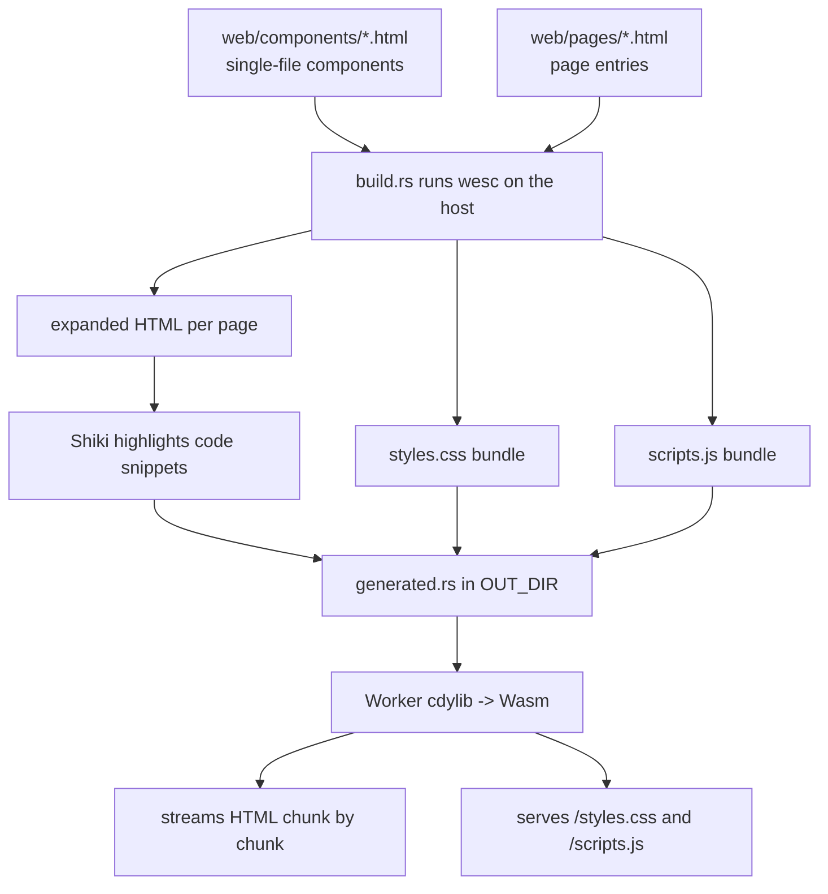

# WeSC site

The WeSC marketing/docs site, written in Rust and deployed as a
[Cloudflare Worker](https://developers.cloudflare.com/workers/languages/rust/).

It **dogfoods wesc**: the pages are authored as single-file `.html` components
and compiled by wesc at build time into expanded HTML plus shared `styles.css`
and `scripts.js` bundles. At request time the Worker streams the HTML and serves
the bundles, routing dynamically so one deployment serves the landing page, the
documentation page, and a request-specific 404.

## How the dogfooding works

wesc can't run inside the Worker — it depends on [rolldown](https://rolldown.rs),
which doesn't target `wasm32-unknown-unknown`. So wesc runs on the **host**, as a
build dependency, in `build.rs`:



- `web/assets.html` is an asset-only manifest containing only
  `rel="definition"` links. wesc resolves those definitions, so one build emits
  the complete `styles.css` + `scripts.js` without producing HTML. Each
  component's top-level `<style>` / `<script>` is stripped from the markup and
  bundled here; Declarative Shadow DOM templates keep their scoped styles inline
  so they render before JS loads.
- Each page in `web/pages/` is expanded HTML-only, then `build.rs` runs Shiki
  over language-tagged code blocks. The Worker streams the final highlighted
  HTML in bounded chunks.

## Layout

| Path                  | What                                                          |
| --------------------- | ------------------------------------------------------------- |
| `web/components/layout.html` | Shared `w-layout` component; pages use it with `w-trim` and fill `title`, `description`, and default content slots. |
| `web/components/*.html` | Single-file wesc components (header, footer, feature card, copy button). |
| `web/pages/*.html`    | Page entries that wrap their content in `<w-layout w-trim>`.  |
| `web/assets.html`     | Link-only asset manifest that pulls in every component to build the CSS/JS bundles. |
| `build.rs`            | Runs wesc (host build dep) to generate HTML + CSS/JS into `OUT_DIR`. |
| `src/lib.rs`          | Worker `fetch` entrypoint: routing, HTML streaming, asset serving. |
| `wrangler.toml`       | Wrangler config; builds the crate with `worker-build`.        |

## Routes

| Route             | Response                                              |
| ----------------- | ----------------------------------------------------- |
| `/`               | Marketing landing page (streamed).                    |
| `/docs`           | Documentation page (streamed).                        |
| `/styles.css`     | Bundled CSS (immutable, long-lived cache).            |
| `/scripts.js`     | Bundled JS (immutable, long-lived cache).             |
| anything else     | A streamed 404 page that echoes the requested path.   |

Trailing slashes are normalized (`/docs/` == `/docs`). Only `GET`/`HEAD` are
served; other methods get a `405`.

## Develop

Prerequisites: a Rust toolchain with the Wasm target, plus
[`worker-build`](https://github.com/cloudflare/workers-rs).

```sh
rustup target add wasm32-unknown-unknown
cargo install worker-build
```

Then, from this directory:

```sh
npm install        # installs wrangler (or use npx)
npm run dev        # fastest authoring loop -> http://localhost:8787
```

Run the command from this `site/` directory.

`npm run dev` starts a tiny local Node server for the fastest authoring loop:

- watches `web/`
- runs the wesc CLI directly into `.dev-dist/`
- streams/serves those generated files locally
- injects a small EventSource live-reload script into HTML responses
- avoids rebuilding the Rust Worker Wasm entirely

Use `npm run dev:worker` when you want Cloudflare Worker parity. It uses the
normal `wrangler.toml` build (`worker-build --release`) with Wrangler's live
reload enabled, so it is slower but exercises the production Worker path.

## Deploy

```sh
npm run deploy     # wrangler deploy
```

This deploys to a `*.workers.dev` subdomain (or a configured Custom Domain).
Stream logs with `npm run tail`.

## Notes

- This crate is intentionally **excluded** from the repo's Cargo workspace (see
  the root `Cargo.toml`) so a host-target `cargo build`/`cargo test` never tries
  to compile the Wasm Worker. Build it only through Wrangler / `worker-build`.
- wesc is a **build dependency only** (`[build-dependencies]`). It never ships in
  the Worker; only the HTML/CSS/JS it produces does.
- Component definition files may include documentation comments before their
  root `<template>`; wesc ignores those pre-template comments and strips them
  from the expanded output.
