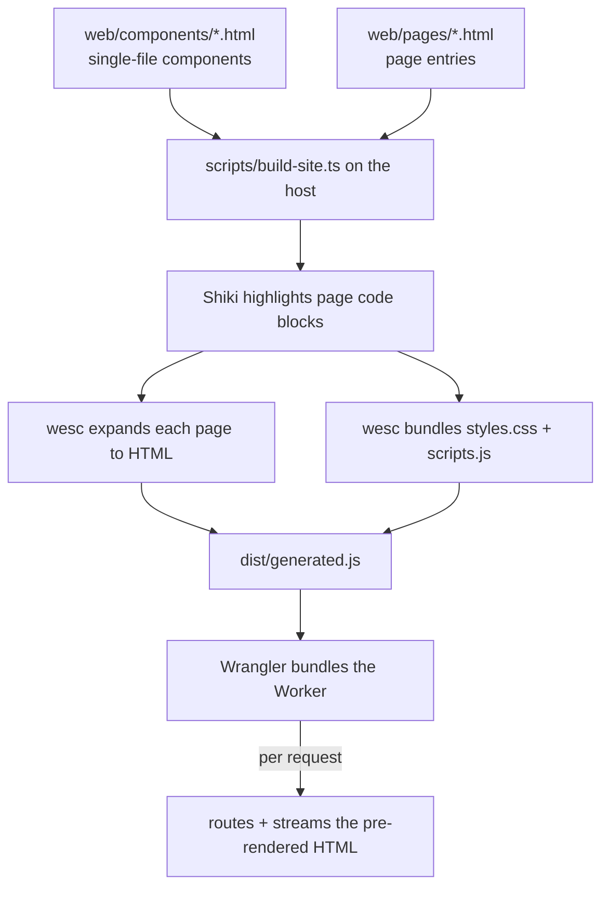

# WeSC site

The WeSC marketing/docs site, a JavaScript/TypeScript
[Cloudflare Worker](https://developers.cloudflare.com/workers/).

It **dogfoods wesc**: the pages are authored as single-file `.html` components
and the site is rendered with the [`wesc`](../packages/wesc) npm package — the
same bundler that powers the CLI and the other bindings. One deployment serves
the landing page, the documentation page, and a request-specific 404.

## How the dogfooding works

Cloudflare Workers run on workerd, which can't load wesc's native Node addon, so
the rendering happens at **build time** on the host (where the `wesc` package
runs natively) and the Worker serves the pre-rendered output. The pages are
static, so this produces the same bytes a per-request render would — the only
request-specific piece is the 404 echoing the requested path, which the Worker
still does at request time.



- `web/assets.html` is an asset-only manifest containing only `rel="definition"`
  links. The build resolves those definitions to bundle the shared `styles.css`
  and `scripts.js` (rolldown handles the JS) into memory.
- Each page's code blocks are syntax-highlighted by Shiki over the page
  **source** (the blocks are static markup) before wesc expands the components
  around them.
- The expanded page HTML plus the CSS/JS bundles are written to
  `dist/generated.js` as string exports; Wrangler inlines that module into the
  Worker, which routes requests and streams the HTML in bounded chunks.

## Layout

| Path                         | What                                                                   |
| ---------------------------- | ---------------------------------------------------------------------- |
| `web/components/layout.html` | Shared `w-layout` component; pages use it with `w-trim` and fill `title`, `description`, and default content slots. |
| `web/components/*.html`      | Single-file wesc components (header, footer, feature card, copy button). |
| `web/pages/*.html`           | Page entries that wrap their content in `<w-layout w-trim>`.           |
| `web/assets.html`            | Link-only asset manifest that pulls in every component to build the CSS/JS bundles. |
| `scripts/build-site.ts`      | Build entrypoint (Wrangler `[build]` / `npm run build`): mirrors `web/`, runs Shiki, renders pages + bundles with the `wesc` package, and writes `dist/generated.js`. |
| `scripts/highlight.ts`       | Shiki highlighting of page code blocks.                                |
| `src/index.ts`               | Worker `fetch` entrypoint: routes, streams the pre-rendered HTML, serves the cached bundles. |
| `wrangler.toml`              | Wrangler config; runs the build script then bundles `src/index.ts`.    |

## Routes

| Route         | Response                                              |
| ------------- | ----------------------------------------------------- |
| `/`           | Marketing landing page (streamed).                    |
| `/docs`       | Documentation page (streamed).                        |
| `/styles.css` | Bundled CSS (immutable cache).                        |
| `/scripts.js` | Bundled JS (immutable cache).                         |
| anything else | A 404 page that echoes the requested path.            |

Trailing slashes are normalized (`/docs/` == `/docs`). Only `GET`/`HEAD` are
served; other methods get a `405`.

## Develop

The build renders with the local `wesc` package, which is a native Node addon,
so build it once from the repo root first:

```sh
npm install              # at the repo root
npm run build:native     # builds packages/wesc/wesc.<platform>.node
```

Then, from this directory:

```sh
npm install              # installs wrangler + tooling, links the local wesc package
npm run dev              # wrangler dev -> http://localhost:8787
```

`npm run dev` runs `wrangler dev`, which executes the `[build]` command (the
same render the deploy uses), serves the Worker on workerd, and live-reloads
when anything under `web/` changes.

Type-check with:

```sh
npm run typecheck        # tsc --noEmit
```

## Deploy

```sh
npm run deploy           # runs the build, then wrangler deploy
```

This deploys to a `*.workers.dev` subdomain (or a configured Custom Domain).
Stream logs with `npm run tail`.

## Notes

- `dist/generated.js` is generated by the build and inlined into the Worker; it
  isn't committed.
- The site is **not** part of the repo's npm workspaces; it has its own
  `package.json` and depends on the local `wesc` package via `file:`.
- Component definition files may include documentation comments before their
  root `<template>`; wesc ignores those pre-template comments and strips them
  from the expanded output.
